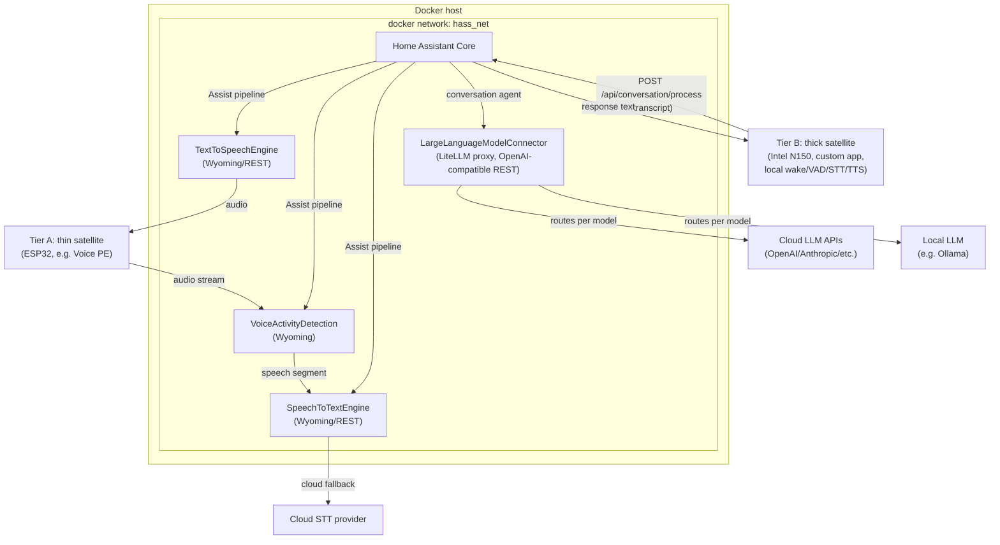

# Home Assistant Setup — Architecture Draft

Status: draft / work in progress
Scope: containerized backend services for the next Home Assistant setup, focused on the voice-assistant pipeline and LLM integration.

## Goals

- Home Assistant Core stays the orchestrator (dashboards, automations, device management, conversation agent) — not a place to embed heavy ML workloads.
- Every non-trivial component (STT, TTS, VAD, LLM routing) runs as its own Docker container with a narrow API, so components can be upgraded, replaced, or scaled independently.
- Prefer protocols HA already understands natively (Wyoming for voice pipeline pieces) over bespoke integrations, falling back to REST + a small custom component only where needed.
- Keep cloud dependency optional and isolated: cloud STT is a fallback path behind a local-first proxy, not a hard requirement.
- Support two satellite tiers side by side (weak ESP32-class devices vs. powerful on-device satellites), configured per device rather than as a global switch.
- The conversation agent needs to control devices, not just chat. HA's own Assist API already provides this as OpenAI-style tool/function calls when device control is enabled on the conversation integration — the LLM connector's job is to proxy those tool calls through untouched, not reimplement device control itself.

## Voice pipeline placement: two satellite tiers

The same pipeline stages (wake word, VAD, STT, TTS) can run in two different places depending on satellite hardware. Both tiers coexist; which one a device uses is a per-satellite configuration choice.

### Tier A — thin satellite (e.g. ESP32-based voice devices)

- Hardware only captures/plays audio. Wake word detection is supported **both ways**: locally on the device (e.g. ESPHome's `micro_wake_word`) or centrally as a stage of **VoiceActivityDetection**, per-device choice. Start with local wake word — lower latency, no dependency on the central service — and migrate a given device to central wake-word detection later if there's a reason to (e.g. a custom/shared keyword, or hardware too weak even for that).
- VAD, STT, and TTS all run centrally — the `VoiceActivityDetection`, `SpeechToTextEngine`, and `TextToSpeechEngine` containers described below, reached over Wyoming.
- Raw audio crosses the LAN in both directions (mic → VAD/STT, TTS → speaker).
- Fits weak/cheap hardware; trades network bandwidth and round-trip latency for near-zero on-device compute.

### Tier B — thick satellite (e.g. Intel N150 mini PC as satellite)

**Scope: post-MVP.** Tier A + the central services + `LargeLanguageModelConnector` form the MVP; Tier B is designed for here at a high level, but detailed implementation is deferred until the MVP is working.

- Runs wake word, VAD, STT, and TTS locally on the satellite itself, with its own engine choices — not necessarily Vosk/Silero. Which engines Tier B uses is configurable independently of the central services and can be decided later, per device if needed.
- Only the recognized text (request) and, on the way back, the response text cross the network. HA and the LLM connector never see raw audio for these devices — the satellite hands HA an already-processed command and speaks HA's text reply itself.
- Not dependent on the central VAD/STT/TTS containers being reachable; needs a capable device to run local inference at acceptable latency.
- **Implemented as a self-built satellite app** — see rationale below, since the off-the-shelf options don't currently give this shape.

Both tiers converge at the same point: HA's conversation agent takes the transcript → **LargeLanguageModelConnector**, and gets text back. Tier A then plays that response through the central TTS container; Tier B synthesizes it locally.

### Why Tier B needs a self-built satellite app

The natural off-the-shelf choice for a fully local satellite, [`wyoming-satellite`](https://github.com/rhasspy/wyoming-satellite) (point its wake/VAD/STT/TTS stages at `localhost` instead of a remote Wyoming service), is now **deprecated**. Its own README says it "is no longer maintained as it has been replaced by [Linux Voice Assistant](https://github.com/OHF-Voice/linux-voice-assistant), which uses the ESPHome protocol."

That replacement doesn't give us Tier B's shape, though: Linux Voice Assistant only runs wake word detection and mic preprocessing (noise suppression/AGC) locally — STT and TTS still go through HA's Assist pipeline over the ESPHome API, the same as Tier A. It's a nicer Tier A satellite, not a Tier B one.

So for genuine "HA only sees finished text" behavior, Tier B is a **small custom satellite service** we build ourselves:

- Local wake word + VAD + STT + TTS running on the N150 — optionally reusing the same STT/TTS engine code/images built for the central `SpeechToTextEngine`/`TextToSpeechEngine` containers, deployed locally instead of centrally, but not required to; exact engines are a separate, later decision (see Decisions/Open questions).
- Talks to HA over its plain REST API — `POST /api/conversation/process` (or the `conversation.process` service via `/api/services/conversation/process`) — sending the transcript and getting the response text back. No Wyoming/ESPHome satellite protocol involved for this tier.
- Registered in HA as a long-lived access token client rather than an `assist_satellite` entity, since we're bypassing HA's audio pipeline entirely.

This is a build-and-maintain-ourselves component, unlike everything else in this doc — accepted trade-off for keeping raw audio off the network for these devices. Keep the implementation as simple as it can be while meeting that requirement, and detailed design (packaging, exact wake-word engine, etc.) waits until Tier B work actually starts. Agreed: revisit this whole approach if/when OHF ships local STT/TTS support in Linux Voice Assistant, and drop the self-maintained app in favor of the upstream-maintained one at that point.

### How this is configured

- Tier A devices are left at HA's defaults (Wyoming or ESPHome voice-assistant integration), which route audio through the central VAD/STT/TTS containers.
- Tier B devices run the custom local satellite app described above and only ever hit HA's conversation REST endpoint.
- Both eventually produce a spoken response for the user; from an automations/dashboard perspective in HA, Tier A devices show up as `assist_satellite` entities while Tier B devices are just another conversation client — that asymmetry is worth keeping in mind when building anything that assumes all voice devices are `assist_satellite` entities.

## Components

Central, always-on services. Used directly by Tier A satellites; Tier B satellites run their own local equivalents of VAD/STT/TTS instead of calling these (see above), but still go through `LargeLanguageModelConnector` for the conversation step.

| Component | Responsibility | Protocol to HA | Backing |
|---|---|---|---|
| **Home Assistant Core** | Dashboards, automations, device/area management, conversation orchestration, pipeline assembly (Assist) | — | Official `homeassistant/home-assistant` container |
| **SpeechToTextEngine** *(Tier A)* | Exposes an STT API; internally proxies to a cloud STT provider with fallback to a local STT engine (starting with Vosk) | Wyoming (preferred) or REST via custom `stt` platform | Custom service wrapping cloud SDK + local model |
| **TextToSpeechEngine** *(Tier A)* | Local TTS synthesis (starting with Silero) | Wyoming (preferred) or REST via custom `tts` platform | Custom service, swappable engine behind a fixed API |
| **VoiceActivityDetection** *(Tier A)* | Detects speech segments in an audio stream before STT is invoked; can optionally also host central wake-word detection as an alternative to on-device wake word | Wyoming | e.g. `openWakeWord`/`webrtcvad`-based Wyoming service |
| **LargeLanguageModelConnector** | Hosts a LiteLLM proxy in front of multiple LLM backends (cloud + local) for the conversation agent; must pass HA's tool/function calls (device control via the Assist API) through to the backend model unmodified | REST (OpenAI-compatible) via HA's `openai_conversation`/`extended_openai_conversation`, or a thin custom `conversation` agent | LiteLLM proxy container |

Everything under "Backing" is a separate container; HA never talks to a model or SDK directly — always through one of these services.

The local STT and TTS engines (Vosk, Silero) are starting choices, not architectural commitments: `SpeechToTextEngine` and `TextToSpeechEngine` each expose a fixed API (Wyoming/REST) with the underlying engine swappable behind it — a different container implementing the same API can replace either without touching HA's config or Tier A satellites.

## Topology



## Voice pipeline data flow

### Tier A (thin satellite, e.g. ESP32)

1. A Tier A satellite streams raw audio into the **Assist pipeline** configured in HA Core.
2. HA's pipeline sends the stream to **VoiceActivityDetection** first, which trims silence and emits only the speech segment (or acts as a Wyoming VAD stage directly ahead of STT, depending on the Wyoming pipeline HA has).
3. The speech segment goes to **SpeechToTextEngine**. Internally it tries the cloud STT provider first (better accuracy) and falls back to a local model (starting with Vosk) if the cloud call fails or times out. HA only ever sees one STT API.
4. The transcript goes into HA's conversation agent, which is configured to call **LargeLanguageModelConnector** (LiteLLM) instead of a single hardcoded provider. LiteLLM picks the target model/provider based on its own routing config (cost, latency, capability, or an explicit model alias configured in HA).
5. The LLM response text goes back through HA to **TextToSpeechEngine**, which synthesizes audio locally and streams it back to the originating satellite.

### Tier B (thick satellite, e.g. N150)

1. The custom Tier B satellite app runs its own local wake word, VAD, and STT. It only contacts HA once it already has a final transcript — HA never receives raw audio from this device.
2. It calls HA's `conversation.process` REST endpoint directly with that transcript; HA's conversation agent takes it straight to **LargeLanguageModelConnector**, same as Tier A step 4.
3. HA returns the response text in that same API call; the satellite synthesizes it with its own local TTS and plays it — the central `TextToSpeechEngine` container is not involved, and no Assist pipeline/satellite protocol is used for this tier.

Each arrow above is a container-to-container (or satellite-to-container) API call inside/adjacent to `hass_net`; nothing here requires HA to know implementation details of STT/TTS/LLM providers — that's encapsulated behind each connector, and for Tier B, behind the satellite itself.

## Integration strategy per component

- **VoiceActivityDetection / SpeechToTextEngine / TextToSpeechEngine** (Tier A): implement (or wrap) the [Wyoming protocol](https://github.com/rhasspy/wyoming) so HA's built-in Wyoming integration can be used as-is — no custom component to maintain. This is the preferred path for all three since HA has first-class support for Wyoming `stt`, `tts`, and `wake-word`/VAD services. Each container wraps a specific engine (Vosk for STT, Silero for TTS to start) behind that same Wyoming API, so the engine can be swapped later without touching this integration.
- **Tier B satellites**: no existing HA integration fits (`wyoming-satellite` is deprecated; its successor, Linux Voice Assistant, doesn't do local STT/TTS — see above), so this is the one deliberately self-implemented piece: a local service on the N150 talking to HA's plain `conversation.process` REST API, not any voice-satellite protocol.
- **LargeLanguageModelConnector**: LiteLLM proxy exposes an OpenAI-compatible REST API, so HA's official `openai_conversation` integration (or `extended_openai_conversation` from HACS if more control over exposed entities/tools is needed) can point at it directly by overriding the API base URL. Device control needs no extra integration work either: when "Control Home Assistant" is enabled on that integration, HA's Assist API turns exposed entities into OpenAI-style tool/function definitions automatically — LiteLLM just needs to proxy those tool calls and their results through to the underlying model unmodified. Worth verifying per backend model, since not everything LiteLLM can route to supports function calling equally well.
- Otherwise, only fall back to a self-implemented custom component if a component can't speak Wyoming/REST in a way an existing integration supports.

## Docker Compose shape (sketch)

Illustrative only — not final compose files yet.

```yaml
networks:
  hass_net:
    driver: bridge

services:
  homeassistant:
    image: homeassistant/home-assistant:stable
    networks: [hass_net]
    volumes: ["./config/homeassistant:/config"]
    # ...

  vad:
    build: ./services/vad
    networks: [hass_net]

  stt:
    build: ./services/stt
    networks: [hass_net]
    environment:
      - CLOUD_STT_API_KEY=${CLOUD_STT_API_KEY}
      - LOCAL_STT_ENGINE=vosk
      - LOCAL_STT_MODEL=vosk-model-small-en-us

  tts:
    build: ./services/tts
    networks: [hass_net]
    environment:
      - TTS_ENGINE=silero

  llm-connector:
    image: ghcr.io/berriai/litellm:latest
    networks: [hass_net]
    volumes: ["./config/litellm/config.yaml:/app/config.yaml"]
    environment:
      - OPENAI_API_KEY=${OPENAI_API_KEY}
      - ANTHROPIC_API_KEY=${ANTHROPIC_API_KEY}
```

Each first-party component (`vad`, `stt`, `tts`) lives in its own `services/<name>` directory with its own Dockerfile once implementation starts. This compose file covers the central host only; Tier B satellites (e.g. the N150) run their own separate deployment of the custom local satellite app (own local VAD/STT/TTS, likely also Docker-based) directly on the satellite hardware, outside this stack.

## Cross-cutting concerns (to flesh out later)

- **Secrets**: cloud API keys (STT provider, LLM providers) via `.env` + Docker secrets, never baked into images or committed configs. Tier B satellites additionally need a long-lived HA access token to call `conversation.process` — scope it as narrowly as HA allows and treat it like any other credential.
- **Networking**: single internal `hass_net` bridge network; only HA (and optionally a reverse proxy) exposed to the host/LAN. STT/TTS/VAD/LLM connector stay internal-only.
- **Observability**: consider a shared logging/metrics story (e.g. container logs to `journald`/Loki) once the pipeline is running, so cloud-fallback events in STT are visible.
- **Resource placement**: local STT/TTS/VAD models are the heaviest components. The actual requirement is **sub-second STT/TTS latency with good Russian-language quality (correct stress/pronunciation)** — CPU-only inference is fine if it hits that; the N150's Intel iGPU (via OpenVINO) is an available lever to pull if CPU alone falls short, not a mandatory design constraint. See Decisions/Open questions for the research behind this and which engines it points to.
- **Failure modes**: define what HA's Assist pipeline does when a connector container is down (timeout behavior, user-facing error) — not yet designed.

## Decisions so far

- Local STT engine: **Vosk**, for Tier A's `SpeechToTextEngine` fallback (starting point) — expected to change, so it sits behind a fixed API rather than being wired in directly (see Components).
- Local TTS engine: **Silero**, for Tier A's `TextToSpeechEngine` (starting point), likewise behind a fixed API and likely to change.
- The real latency requirement is **sub-second STT/TTS with good Russian quality (correct stress/pronunciation)**, not "must use the iGPU" — CPU-only inference is acceptable if it hits that bar; iGPU acceleration is a fallback lever, and both Vosk/Silero and any alternative should stay swappable so more than one can be tried (see research below).
- Tier B's STT/TTS engines are a separate, independent decision — not necessarily Vosk/Silero, deferred until Tier B implementation starts (Tier B is post-MVP).
- LLM connector needs to support device control, not just chat — handled by HA's own Assist API/tool-calling (see Goals and Integration strategy), not something `LargeLanguageModelConnector` needs to implement itself.
- Wake word: support both local (Tier A device, e.g. `micro_wake_word`) and central (`VoiceActivityDetection`) detection. Start local per device; migrate a device to central detection based on an A/B test between the two, not on a fixed rule.
- Tier B's satellite app: keep it as simple as possible while still meeting "HA only sees finished text"; it needs its own local wake-word detection (no dependency on the central `VoiceActivityDetection`, since Tier B never streams audio anywhere). Detailed design (packaging, exact wake-word engine) is deferred — Tier B is explicitly post-MVP.
- If/when Linux Voice Assistant grows local STT/TTS support, revisit Tier B and drop the self-maintained satellite app in favor of the upstream-maintained one.

### Research: STT/TTS engine options for Russian, latency, and iGPU acceleration

- **Vosk**: originated from a Russian-speaking team (Alpha Cephei), ships dedicated Russian models (small ~50MB for constrained hardware, large for max accuracy — roughly 20% more accurate but far heavier), and is explicitly designed for low CPU latency. Its only GPU path is **CUDA/NVIDIA-only** (`alphacep/kaldi-vosk-server-gpu`) — no Intel iGPU/OpenVINO support exists, so it runs CPU-only on the N150. This fits the reframed requirement, since Vosk's CPU-first design is exactly what's needed here.
- **Silero TTS**: also Russian-team-rooted, and per an independent evaluation of Russian TTS models ([alphacephei.com](https://alphacephei.com/nsh/2024/07/12/russian-tts.html), from the Vosk maintainers), Silero-style (FastSpeech2-based) models have the **best clarity** among the Russian TTS options compared, and Silero ships a dedicated stress/homograph model (`silero-stress`, ~4M known words, ~91% per-word accuracy on homographs) specifically for correct Russian stress placement — directly addresses the "correct stress and pronunciation" requirement. CPU-only benchmarks on a desktop-class x86 CPU (Intel i7-6800K) show 1.4×–4.9× faster than real-time depending on thread count; no official ONNX export exists, so there's **no OpenVINO/Intel-iGPU path** today (PyTorch/CPU or CUDA only).
- **Whisper (whisper.cpp) + Piper**: the multilingual alternative. Both have mature, proven Intel-iGPU acceleration via OpenVINO's ONNX Runtime execution provider, with existing community **Wyoming-protocol** containers built for exactly this: [`ha-intel-openvino-whisper-app`](https://github.com/Wheemer/ha-intel-openvino-whisper-app) (STT, port 10300) and [`ha-piper-openvino-app`](https://github.com/Wheemer/ha-piper-openvino-app) (TTS, port 10200), both targeting `/dev/dri/renderD128` on Intel iGPUs. On Russian quality specifically, though, Piper's Russian voices are community-trained on limited data (e.g. the Irina voice on ~1 hour of audio) and that same evaluation put FastSpeech2-style models (Silero) ahead of alternatives on clarity — so Piper looks like the better latency/iGPU story but a plausibly weaker Russian-quality story than Silero.
- **Conclusion**: keep **Vosk + Silero** as the default, since Russian-language quality and stress-correctness are exactly their strength, and their CPU-first design should plausibly hit sub-second latency on the N150 without needing the iGPU at all. Keep **Whisper (whisper.cpp) + Piper** documented as the concrete fallback to trial if real-world benchmarking (see Open questions) shows Vosk/Silero don't hit the sub-second bar on the N150 — both already have ready-made, iGPU-accelerated Wyoming containers to drop in behind the same API, matching the "containers should be interchangeable, try both" approach.

## Open questions

- Exact Vosk model/language pack for Tier A's fallback STT — accuracy vs. footprint trade-off.
- Exact Silero voice/language for Tier A's TTS.
- **Benchmark actual sub-second latency for Vosk STT + Silero TTS on real N150-class CPU hardware**, with realistic short Russian utterances — no public benchmark exists for this specific chip; if it doesn't hit the target, fall back to the iGPU-accelerated Whisper/Piper containers already identified above.
- Confirm LiteLLM correctly passes HA's Assist tool-calling through to each backend model in the routing config — behavior can differ per provider/model, worth testing explicitly once models are chosen.
- Tier B (post-MVP, deferred): STT/TTS engine choice, wake-word engine, and packaging/deployment shape (systemd service vs. Docker Compose on the N150).
