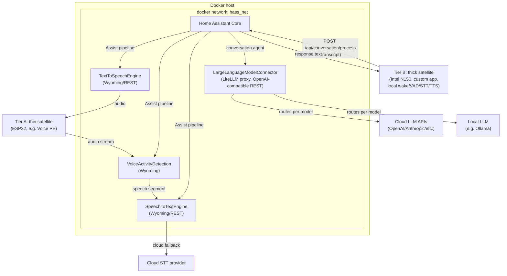

# Home Assistant Setup — Architecture Draft

Status: draft / work in progress
Scope: containerized backend services for the next Home Assistant setup, focused on the voice-assistant pipeline and LLM integration.

## Goals

- Home Assistant Core stays the orchestrator (dashboards, automations, device management, conversation agent) — not a place to embed heavy ML workloads.
- Every non-trivial component (STT, TTS, VAD, LLM routing) runs as its own Docker container with a narrow API, so components can be upgraded, replaced, or scaled independently.
- Prefer protocols HA already understands natively (Wyoming for voice pipeline pieces) over bespoke integrations, falling back to REST + a small custom component only where needed.
- Keep cloud dependency optional and isolated: cloud STT is a fallback path behind a local-first proxy, not a hard requirement.
- Support two satellite tiers side by side (weak ESP32-class devices vs. powerful on-device satellites), configured per device rather than as a global switch.
- The conversation agent needs to control devices, not just chat. HA's own Assist API already provides this as OpenAI-style tool/function calls when device control is enabled on the conversation integration — the LLM connector's job is to proxy those tool calls through untouched, not reimplement device control itself.

## MVP milestones

Delivery order for the MVP scope (Tier A + central services + LLM connector — see Tier B section below for what's explicitly post-MVP). Each milestone should be independently usable, not just a step toward the next.

### Milestone 1 — Core pipeline, on-device wake word + VAD, direct OpenRouter

- Home Assistant Core running.
- Central `SpeechToTextEngine` and `TextToSpeechEngine` containers online (Vosk/Silero to start), reached over Wyoming.
- Tier A satellite(s) handle **both** wake word and VAD on-device — no `VoiceActivityDetection` container yet. Simplest possible working voice loop.
- Conversation agent talks **directly to OpenRouter** — HA's own OpenRouter integration (or `openai_conversation` pointed at OpenRouter's endpoint), no `LargeLanguageModelConnector`/LiteLLM in front yet.
- Goal: a complete, working voice assistant end to end, before adding any routing flexibility on top.

### Milestone 2 — LiteLLM proxy in front of OpenRouter

**Status: proxy deployed and verified; switching HA's pipeline over to it is the last step** — see "Milestone 2 implementation notes" below.

- Stand up `LargeLanguageModelConnector` (the LiteLLM proxy) and switch HA's conversation agent to it via the official `litellm` HA integration.
- Configure OpenRouter as one of LiteLLM's provider entries — functionally equivalent to Milestone 1 at first, but now provider-swappable (see Decisions/Research on keeping LiteLLM as the primary gateway).
- This is where the LiteLLM tool-calling passthrough needs to be validated end to end (see Research above) before relying on it for real device control.
- Additional providers or local models can be added to LiteLLM's config after this point without further architecture changes.

### Milestone 3 — Central VAD, optional central wake word

- Bring up the `VoiceActivityDetection` container and migrate Tier A satellites to server-side VAD.
- Central wake word becomes an option per device, not a requirement — the A/B-test-driven migration from local to central wake word (see Decisions) applies from here on.
- Completes the Tier A architecture as documented above: VAD/STT/TTS all centralized, wake word local-or-central per device.

**Status / correction (2026-09-21):** the `VoiceActivityDetection` container has no integration point — HA's Assist pipeline runs VAD internally (finished-speaking detection) and has no Wyoming VAD stage — so this milestone is really *central wake word + pre-roll*. Central wake word container and pre-roll are built and measured; the satellite firmware change is not. See "Milestone 3 implementation notes".

Tier B (the N150 thick-satellite custom app) and trialing the Whisper/Piper fallback stay explicitly **post-MVP**, picked up after Milestone 3.

## Voice pipeline placement: two satellite tiers

The same pipeline stages (wake word, VAD, STT, TTS) can run in two different places depending on satellite hardware. Both tiers coexist; which one a device uses is a per-satellite configuration choice.

### Tier A — thin satellite (e.g. ESP32-based voice devices)

- Hardware only captures/plays audio. Wake word detection is supported **both ways**: locally on the device (e.g. ESPHome's `micro_wake_word`) or centrally as a stage of **VoiceActivityDetection**, per-device choice. Start with local wake word — lower latency, no dependency on the central service — and migrate a given device to central wake-word detection later if there's a reason to (e.g. a custom/shared keyword, or hardware too weak even for that).
- VAD, STT, and TTS all run centrally — the `VoiceActivityDetection`, `SpeechToTextEngine`, and `TextToSpeechEngine` containers described below, reached over Wyoming.
- Raw audio crosses the LAN in both directions (mic → VAD/STT, TTS → speaker).
- Fits weak/cheap hardware; trades network bandwidth and round-trip latency for near-zero on-device compute.

### Tier B — thick satellite (e.g. Intel N150 mini PC as satellite)

**Scope: post-MVP.** Tier A + the central services + `LargeLanguageModelConnector` form the MVP; Tier B is designed for here at a high level, but detailed implementation is deferred until the MVP is working.

- Runs wake word, VAD, STT, and TTS locally on the satellite itself, with its own engine choices — not necessarily Vosk/Silero. Which engines Tier B uses is configurable independently of the central services and can be decided later, per device if needed.
- Only the recognized text (request) and, on the way back, the response text cross the network. HA and the LLM connector never see raw audio for these devices — the satellite hands HA an already-processed command and speaks HA's text reply itself.
- Not dependent on the central VAD/STT/TTS containers being reachable; needs a capable device to run local inference at acceptable latency.
- **No pause required between wake word and command** (the "Alice/Google Assistant" experience — say "<wake word>, what's the weather" in one breath, no waiting for a chime). Since we own the whole local pipeline here, wake-word detection can run on a continuous rolling buffer and hand off directly into STT the moment it triggers (including its pre-roll), instead of gating capture behind a played chime the way HA's stock Assist/ESPHome flow does. This is a genuine capability Tier B has that Tier A (stuck with the stock chime-gated flow) doesn't get for free — see research below on the platform choice.
- **Implemented as a self-built satellite app** — see rationale below, since the off-the-shelf options don't currently give this shape.

Both tiers converge at the same point: HA's conversation agent takes the transcript → **LargeLanguageModelConnector**, and gets text back. Tier A then plays that response through the central TTS container; Tier B synthesizes it locally.

### Why Tier B needs a self-built satellite app

The natural off-the-shelf choice for a fully local satellite, [`wyoming-satellite`](https://github.com/rhasspy/wyoming-satellite) (point its wake/VAD/STT/TTS stages at `localhost` instead of a remote Wyoming service), is now **deprecated**. Its own README says it "is no longer maintained as it has been replaced by [Linux Voice Assistant](https://github.com/OHF-Voice/linux-voice-assistant), which uses the ESPHome protocol."

That replacement doesn't give us Tier B's shape, though: Linux Voice Assistant only runs wake word detection and mic preprocessing (noise suppression/AGC) locally — STT and TTS still go through HA's Assist pipeline over the ESPHome API, the same as Tier A. It's a nicer Tier A satellite, not a Tier B one.

So for genuine "HA only sees finished text" behavior, Tier B is a **small custom satellite service** we build ourselves:

- Local wake word + VAD + STT + TTS running on the N150 — optionally reusing the same STT/TTS engine code/images built for the central `SpeechToTextEngine`/`TextToSpeechEngine` containers, deployed locally instead of centrally, but not required to; exact engines are a separate, later decision (see Decisions/Open questions).
- Talks to HA over its plain REST API — `POST /api/conversation/process` (or the `conversation.process` service via `/api/services/conversation/process`) — sending the transcript and getting the response text back. No Wyoming/ESPHome satellite protocol involved for this tier.
- Registered in HA as a long-lived access token client rather than an `assist_satellite` entity, since we're bypassing HA's audio pipeline entirely.

This is a build-and-maintain-ourselves component, unlike everything else in this doc — accepted trade-off for keeping raw audio off the network for these devices. Keep the implementation as simple as it can be while meeting that requirement, and detailed design (packaging, exact wake-word engine, etc.) waits until Tier B work actually starts. Agreed: revisit this whole approach if/when OHF ships local STT/TTS support in Linux Voice Assistant, and drop the self-maintained app in favor of the upstream-maintained one at that point.

### Research: what platform to base the Tier B prototype on

"Self-built" doesn't have to mean "from scratch." Candidates considered for the base to build on:

- **[OpenVoiceOS (OVOS)](https://www.openvoiceos.org/)** — **recommended**. An actively maintained (releases as recently as August 2026), plugin-based voice assistant framework — the spiritual successor to Mycroft AI. It already has official, maintained plugins for exactly our chosen engines: [`ovos-stt-plugin-vosk`](https://github.com/OpenVoiceOS/ovos-stt-plugin-vosk) and [`ovos-tts-plugin-silero`](https://pypi.org/project/ovos-tts-plugin-silero/), plus a wake-word plugin for openWakeWord (`ovos-ww-plugin-openWakeWord`) and others (Precise/Precise-Lite, now ONNX-based). Its plugin manager (`ovos-plugin-manager`) is exactly the "swappable engine behind a fixed interface" pattern this doc keeps insisting on for STT/TTS/wake-word, so it doesn't fight our architecture — it *is* our architecture, already built.
  - Proof the shape we want actually works in OVOS: [`HiveMind-voice-sat`](https://github.com/JarbasHiveMind/HiveMind-voice-sat) is a full-stack OVOS-based satellite that already runs mic capture + VAD + wake word + STT + TTS **entirely locally** and sends only recognized text onward to its (HiveMind) server — the exact "HA only sees finished text" shape we need, just pointed at a different backend. Our job is a much smaller one: swap HiveMind-voice-sat's (or plain OVOS's) server target for HA's `conversation.process` REST endpoint instead of building the mic/wake/VAD/STT/TTS orchestration ourselves.
  - There's an existing OVOS↔HA skill ([`skill-homeassistant`](https://github.com/OscillateLabsLLC/skill-homeassistant), the maintained successor to the older `ovos-PHAL-plugin-homeassistant`) — worth evaluating first in case it already offers (or can be adapted into) a pass-through mode that forwards *all* utterances to HA's conversation agent, rather than doing its own NLU/device-control the way it's designed for by default. If not, writing a small custom OVOS pipeline/fallback plugin that does this is a modest addition on top of OVOS's existing audio stack, not a new subsystem.
  - Needs verification once Tier B work starts: whether OVOS's listener already buffers a pre-roll before the wake-word trigger (avoiding the "first word clipped" problem) closely enough to deliver the no-pause experience above, or whether that needs tuning/patching.
- **Fork/vendor `wyoming-satellite`** — it already implements local wake word, VAD, mic capture, and playback orchestration, and is a smaller/less opinionated codebase than OVOS. Ruled out as the primary pick because it's deprecated upstream (no more fixes/features) and its plugin surface for STT/TTS engines is thinner than OVOS's.
- **Rhasspy 3** — was the modern rewrite of Rhasspy, but was archived in May 2026. Ruled out as a dead end.
- **From-scratch Python** (sounddevice/pyaudio + openWakeWord + a VAD library + Vosk + Silero, wired up by hand) — the fallback if OVOS turns out too heavy or too opinionated for "keep it simple." Full control, but reinvents plumbing OVOS already provides, and loses the plugin-swappability we get for free from OVOS.

### Research: hardware platform for the Tier B prototype

| | Intel N150 mini PC (baseline) | Intel N305 mini PC | Raspberry Pi 5 (8GB) | NVIDIA Jetson Orin Nano Super |
|---|---|---|---|---|
| CPU | 4 cores/4 threads, 6W TDP | 8 cores/8 threads, ~7–15W TDP | 4-core Cortex-A76 @ 2.4GHz, ARM | 6-core Cortex-A78AE @ 1.7GHz, ARM |
| GPU/accelerator | UHD Graphics Xe, 24 EU — **no path for Vosk/Silero** (see below) | UHD Graphics, 32 EU — same limitation | VideoCore VII — not usable for this kind of ML inference | 1024 CUDA cores + 32 Tensor cores (Ampere) |
| Vosk/Silero acceleration | None (CPU-only; Vosk GPU=CUDA-only, Silero has no ONNX/OpenVINO path — see earlier research) | None, same reason | None, same reason | **Both accelerate natively** — Vosk's GPU path is CUDA, and Silero is plain PyTorch with native CUDA support (no conversion needed) |
| Ecosystem fit | Mainstream x86_64 Linux/Docker — identical toolchain to the central host and every other container in this doc; Vosk/Silero/OVOS all have first-class x86_64 support | Same as N150, just more cores | ARM64 — historically *the* reference platform for Mycroft/OVOS specifically; Vosk has long-standing Raspberry Pi support; Silero on ARM is less battle-tested (no public benchmarks found) | ARM64 + NVIDIA's JetPack/L4T (a versioned Ubuntu derivative tied to specific CUDA/cuDNN releases) — capable but a different, more specialized OS/dependency story than the rest of this stack |
| Price / power (approx.) | ~$100–150, 6W | ~$300+, ~15W | ~$80–120 all-in, 5–10W | ~$249, likely 15–25W in its higher power modes |
| Fanless/quiet | Yes, common | Usually yes | Yes | Needs a small fan/heatsink in most builds |

**Findings worth calling out:**
- The earlier "no Intel iGPU path for Vosk/Silero" finding is Intel/OpenVINO-specific, not universal: Silero is a plain PyTorch model, so it already has **native CUDA support** with zero conversion work — an NVIDIA-based board unlocks real GPU acceleration for *both* our chosen engines (Vosk's GPU path is also CUDA-only) simultaneously, something no Intel or ARM SBC in this comparison can do.
- Raspberry Pi 5 numbers found for a comparable stack (OpenWakeWord + Vosk + Piper) look promising on CPU alone — around 300–400MB RAM and 15–25% CPU during active speech, with Piper TTS synthesizing a short phrase in ~0.8–1.6s. No direct Silero-on-ARM benchmark was found, so this needs verifying if RPi5 is actually pursued (Silero explicitly says more than 4 threads doesn't help it, which happens to match Pi 5's 4 cores).
- N305 is the lowest-friction escalation path if N150 turns out CPU-constrained running wake-word+STT+TTS concurrently: same x86/Intel ecosystem, same OS/software stack, just more cores — no re-platforming needed.

**Recommendation**: keep the **Intel N150-class mini PC** as the default for the Tier B prototype. It's the cheapest, lowest-power option, stays on the same x86_64/Docker toolchain as everything else in this architecture (no cross-compilation or ARM-specific quirks for Vosk/Silero/OVOS), and the earlier research already concluded CPU-only should plausibly hit the sub-second latency target. Treat **Jetson Orin Nano Super** as the concrete fallback specifically if N150 CPU-only benchmarking (see Open questions) falls short — it's the one platform where both chosen engines get genuine hardware acceleration without switching engines. Treat **Raspberry Pi 5** as a cost/power-optimized alternative worth a side-by-side trial if scaling to several Tier B satellites (one per room) makes per-unit cost and power draw matter more than they do for a single prototype.

### How this is configured

- Tier A devices are left at HA's defaults (Wyoming or ESPHome voice-assistant integration), which route audio through the central VAD/STT/TTS containers.
- Tier B devices run the custom local satellite app described above and only ever hit HA's conversation REST endpoint.
- Both eventually produce a spoken response for the user; from an automations/dashboard perspective in HA, Tier A devices show up as `assist_satellite` entities while Tier B devices are just another conversation client — that asymmetry is worth keeping in mind when building anything that assumes all voice devices are `assist_satellite` entities.

## Components

Central, always-on services. Used directly by Tier A satellites; Tier B satellites run their own local equivalents of VAD/STT/TTS instead of calling these (see above), but still go through `LargeLanguageModelConnector` for the conversation step.

| Component | Responsibility | Protocol to HA | Backing |
|---|---|---|---|
| **Home Assistant Core** | Dashboards, automations, device/area management, conversation orchestration, pipeline assembly (Assist) | — | Official `homeassistant/home-assistant` container |
| **SpeechToTextEngine** *(Tier A)* | Exposes an STT API; internally proxies to a cloud STT provider with fallback to a local STT engine (starting with Vosk) | Wyoming (preferred) or REST via custom `stt` platform | Custom service wrapping cloud SDK + local model |
| **TextToSpeechEngine** *(Tier A)* | Local TTS synthesis (starting with Silero) | Wyoming (preferred) or REST via custom `tts` platform | Custom service, swappable engine behind a fixed API |
| **VoiceActivityDetection** *(Tier A)* | Detects speech segments in an audio stream before STT is invoked; can optionally also host central wake-word detection as an alternative to on-device wake word | Wyoming | e.g. `openWakeWord`/`webrtcvad`-based Wyoming service |
| **LargeLanguageModelConnector** | Hosts a LiteLLM proxy in front of multiple LLM backends (cloud + local) for the conversation agent; must pass HA's tool/function calls (device control via the Assist API) through to the backend model unmodified | REST (OpenAI-compatible) via HA's official `litellm` integration (preferred) or `openai_conversation`/`extended_openai_conversation` | LiteLLM proxy container |

Everything under "Backing" is a separate container; HA never talks to a model or SDK directly — always through one of these services.

The local STT and TTS engines (Vosk, Silero) are starting choices, not architectural commitments: `SpeechToTextEngine` and `TextToSpeechEngine` each expose a fixed API (Wyoming/REST) with the underlying engine swappable behind it — a different container implementing the same API can replace either without touching HA's config or Tier A satellites.

## Topology



## Voice pipeline data flow

### Tier A (thin satellite, e.g. ESP32)

1. A Tier A satellite streams raw audio into the **Assist pipeline** configured in HA Core.
2. HA's pipeline sends the stream to **VoiceActivityDetection** first, which trims silence and emits only the speech segment (or acts as a Wyoming VAD stage directly ahead of STT, depending on the Wyoming pipeline HA has).
3. The speech segment goes to **SpeechToTextEngine**. Internally it tries the cloud STT provider first (better accuracy) and falls back to a local model (starting with Vosk) if the cloud call fails or times out. HA only ever sees one STT API.
4. The transcript goes into HA's conversation agent, which is configured to call **LargeLanguageModelConnector** (LiteLLM) instead of a single hardcoded provider. LiteLLM picks the target model/provider based on its own routing config (cost, latency, capability, or an explicit model alias configured in HA).
5. The LLM response text goes back through HA to **TextToSpeechEngine**, which synthesizes audio locally and streams it back to the originating satellite.

### Tier B (thick satellite, e.g. N150)

1. The custom Tier B satellite app runs its own local wake word, VAD, and STT. It only contacts HA once it already has a final transcript — HA never receives raw audio from this device.
2. It calls HA's `conversation.process` REST endpoint directly with that transcript; HA's conversation agent takes it straight to **LargeLanguageModelConnector**, same as Tier A step 4.
3. HA returns the response text in that same API call; the satellite synthesizes it with its own local TTS and plays it — the central `TextToSpeechEngine` container is not involved, and no Assist pipeline/satellite protocol is used for this tier.

Each arrow above is a container-to-container (or satellite-to-container) API call inside/adjacent to `hass_net`; nothing here requires HA to know implementation details of STT/TTS/LLM providers — that's encapsulated behind each connector, and for Tier B, behind the satellite itself.

## Integration strategy per component

- **VoiceActivityDetection / SpeechToTextEngine / TextToSpeechEngine** (Tier A): implement (or wrap) the [Wyoming protocol](https://github.com/rhasspy/wyoming) so HA's built-in Wyoming integration can be used as-is — no custom component to maintain. This is the preferred path for all three since HA has first-class support for Wyoming `stt`, `tts`, and `wake-word`/VAD services. Each container wraps a specific engine (Vosk for STT, Silero for TTS to start) behind that same Wyoming API, so the engine can be swapped later without touching this integration.
- **Tier B satellites**: no existing HA integration fits (`wyoming-satellite` is deprecated; its successor, Linux Voice Assistant, doesn't do local STT/TTS — see above), so this is the one deliberately self-implemented piece: a local service on the N150 talking to HA's plain `conversation.process` REST API, not any voice-satellite protocol.
- **LargeLanguageModelConnector**: HA now has an official [`litellm` integration](https://www.home-assistant.io/integrations/litellm/) (added 2026, currently "bronze" quality tier) built specifically to use a LiteLLM proxy as a conversation agent — prefer it over hand-configuring `openai_conversation`'s base URL, though that still works as a fallback (or `extended_openai_conversation` from HACS for more control over exposed entities/tools). Device control needs no extra integration work: when the agent is granted control of HA, the Assist API turns exposed entities into tool/function definitions automatically, and the `litellm` integration calls them the same way `openai_conversation` does. See the research note below — the LiteLLM proxy layer itself has real, documented failure modes for tool-calling passthrough, so this needs explicit end-to-end testing per backend model, not just "it should work because it's OpenAI-compatible."
- Otherwise, only fall back to a self-implemented custom component if a component can't speak Wyoming/REST in a way an existing integration supports.

### Research: LiteLLM tool-calling passthrough reliability

Tool-calling through a LiteLLM proxy is **not a safe assumption** — it's a real risk area with documented failure modes, not just "different providers behave slightly differently":

- **Streaming can silently drop tool calls.** When a backend model returns text *and* a tool call in the same turn, LiteLLM's proxy has a confirmed bug where the tool-call portion never reaches the client over streaming — only the text comes through ([BerriAI/litellm#17246](https://github.com/BerriAI/litellm/issues/17246)). For a voice assistant, that would look like the LLM "seeing" the request and chatting back without ever calling the tool.
- **Native tool calls can get flattened into text.** A real debugging report (someone doing effectively this same HA + LiteLLM + local-model setup) traced a case where structured tool calls were being serialized into a plain-text JSON blob instead of being forwarded as an actual `tool_calls` response — reproduced specifically when routing to a model via Ollama's own API shape through LiteLLM, not LiteLLM's native provider routing.
- **Anthropic-specific quirk**: LiteLLM's Anthropic translation raises an error if the conversation history contains prior tool calls but the *current* request omits the `tools` parameter — Anthropic's own API tolerates this, LiteLLM's layer doesn't. Could break multi-turn tool-using conversations if HA (or LiteLLM's own config) ever sends a follow-up request without re-declaring tools.
- **Ollama/local models need explicit opt-in and vary widely in reliability.** LiteLLM requires `supports_function_calling: true` set explicitly per model in its config for Ollama-backed models — it's not automatic. And independent of LiteLLM's plumbing, local models genuinely differ in how reliably they emit a structured tool call vs. just describing what they'd do in text; this is a model-capability problem on top of the proxy-correctness problem.

**Practical implication**: validate the whole chain (HA → `litellm` integration → LiteLLM proxy → backend model) with a model known for reliable tool calling (e.g. a current GPT or Claude model) first, to confirm the pipeline itself works, before trusting any local/Ollama model's tool-calling for real device control. Don't assume "OpenAI-compatible" means tool-calling is solved end to end.

### Research: alternatives to LiteLLM as the gateway

The goal driving this research wasn't "replace LiteLLM" but "stop being locked into OpenRouter as the only provider" — which a gateway solves just by having more than one provider configured behind it, OpenRouter included. LiteLLM already does that, and it's the only option here with a **purpose-built HA integration** (see above), so it stays primary. Alternatives worth knowing about if LiteLLM's tool-calling bugs turn out to actually bite in testing:

| | LiteLLM (current choice) | [Bifrost](https://docs.getbifrost.ai/overview) | [Portkey Gateway](https://github.com/portkey-ai/gateway) |
|---|---|---|---|
| License / maturity | Open source, most widely deployed of the three | Apache 2.0, newer (Go, by Maxim AI) | Open source, in production at several companies |
| HA integration | Official `litellm` integration (bronze tier) | None — would need the generic `openai_conversation` base-URL override, same as any OpenAI-compatible endpoint | None — same generic override |
| Tool-calling | Documented bugs (see above): streaming can drop tool calls, Ollama-routed calls can get flattened to text | Markets a native MCP gateway + "Agent Mode" for tool execution; not enough field reports yet to know its edge-case reliability | Explicit function-calling support; built-in retries/fallback could actually mask a flaky tool-call response |
| Performance | Baseline | Claims ~54× LiteLLM's raw throughput in vendor benchmarks — likely irrelevant at home-assistant request volumes | Not a differentiator at this scale either |
| Providers | 140+, most exhaustive coverage, incl. OpenRouter | 25+, incl. Ollama/vLLM | 100+ |

Other options surfaced but not pursued further: **Kong AI Gateway** (built on Kong/NGINX — heavier footprint than this setup needs), **TensorZero** (more an LLM-ops/experimentation platform than a drop-in gateway), and smaller community proxies like `LLM-API-Key-Proxy` (lighter-weight key-rotation focus, less production track record).

**Conclusion**: keep LiteLLM. Put OpenRouter behind it as one provider among several — that alone removes the OpenRouter lock-in without adding a second, less battle-tested gateway layer on top of an already-new voice pipeline. Revisit Bifrost or Portkey specifically if LiteLLM's tool-calling bugs prove to be a real blocker during end-to-end testing (see the test plan above and in Open questions).

## Docker Compose shape (sketch)

Illustrative only — not final compose files yet.

```yaml
networks:
  hass_net:
    driver: bridge

services:
  homeassistant:
    image: homeassistant/home-assistant:stable
    networks: [hass_net]
    volumes: ["./config/homeassistant:/config"]
    # ...

  vad:
    build: ./services/vad
    networks: [hass_net]

  stt:
    build: ./services/stt
    networks: [hass_net]
    environment:
      - CLOUD_STT_API_KEY=${CLOUD_STT_API_KEY}
      - LOCAL_STT_ENGINE=vosk
      - LOCAL_STT_MODEL=vosk-model-small-en-us

  tts:
    build: ./services/tts
    networks: [hass_net]
    environment:
      - TTS_ENGINE=silero

  llm-connector:
    image: ghcr.io/berriai/litellm:v1.102.0  # pinned, not :latest -- see Milestone 2 notes
    networks: [hass_net]
    volumes: ["./config/litellm/config.yaml:/app/config.yaml"]
    environment:
      # config.yaml lists multiple providers (OpenRouter among them, not the only one) —
      # keys below are examples, actual set depends on config.yaml's model list
      - OPENROUTER_API_KEY=${OPENROUTER_API_KEY}
      - OPENAI_API_KEY=${OPENAI_API_KEY}
      - ANTHROPIC_API_KEY=${ANTHROPIC_API_KEY}
```

Each first-party component (`vad`, `stt`, `tts`) lives in its own `services/<name>` directory with its own Dockerfile once implementation starts. This compose file covers the central host only; Tier B satellites (e.g. the N150) run their own separate deployment of the custom local satellite app (own local VAD/STT/TTS, likely also Docker-based) directly on the satellite hardware, outside this stack.

## Cross-cutting concerns (to flesh out later)

- **Secrets**: cloud API keys (STT provider, LLM providers) via `.env` + Docker secrets, never baked into images or committed configs. Tier B satellites additionally need a long-lived HA access token to call `conversation.process` — scope it as narrowly as HA allows and treat it like any other credential.
- **Networking**: single internal `hass_net` bridge network; only HA (and optionally a reverse proxy) exposed to the host/LAN. STT/TTS/VAD/LLM connector stay internal-only.
- **Observability**: consider a shared logging/metrics story (e.g. container logs to `journald`/Loki) once the pipeline is running, so cloud-fallback events in STT are visible.
- **Resource placement**: local STT/TTS/VAD models are the heaviest components. The actual requirement is **sub-second STT/TTS latency with good Russian-language quality (correct stress/pronunciation)** — CPU-only inference is fine if it hits that; the N150's Intel iGPU (via OpenVINO) is an available lever to pull if CPU alone falls short, not a mandatory design constraint. See Decisions/Open questions for the research behind this and which engines it points to.
- **Failure modes**: define what HA's Assist pipeline does when a connector container is down (timeout behavior, user-facing error) — not yet designed.

## Decisions so far

- Local STT engine: **Vosk**, for Tier A's `SpeechToTextEngine` fallback (starting point) — expected to change, so it sits behind a fixed API rather than being wired in directly (see Components).
- Local TTS engine: **Silero**, for Tier A's `TextToSpeechEngine` (starting point), likewise behind a fixed API and likely to change.
- The real latency requirement is **sub-second STT/TTS with good Russian quality (correct stress/pronunciation)**, not "must use the iGPU" — CPU-only inference is acceptable if it hits that bar; iGPU acceleration is a fallback lever, and both Vosk/Silero and any alternative should stay swappable so more than one can be tried (see research below).
- Tier B's STT/TTS engines are a separate, independent decision — not necessarily Vosk/Silero, deferred until Tier B implementation starts (Tier B is post-MVP).
- LLM connector needs to support device control, not just chat — handled by HA's own Assist API/tool-calling (see Goals and Integration strategy), not something `LargeLanguageModelConnector` needs to implement itself.
- **LiteLLM stays the primary `LargeLanguageModelConnector` gateway.** Not being locked into OpenRouter doesn't require dropping it: configure OpenRouter as just one provider entry in LiteLLM's routing config, alongside direct API keys (OpenAI, Anthropic, Google, etc.) and local models (Ollama). See research below for alternatives considered and when to reconsider this choice.
- Wake word: support both local (Tier A device, e.g. `micro_wake_word`) and central (`VoiceActivityDetection`) detection. Start local per device; migrate a device to central detection based on an A/B test between the two, not on a fixed rule.
- Tier B's satellite app: keep it as simple as possible while still meeting "HA only sees finished text"; it needs its own local wake-word detection (no dependency on the central `VoiceActivityDetection`, since Tier B never streams audio anywhere). Detailed design (packaging, exact wake-word engine) is deferred — Tier B is explicitly post-MVP.
- If/when Linux Voice Assistant grows local STT/TTS support, revisit Tier B and drop the self-maintained satellite app in favor of the upstream-maintained one.
- **Tier B is a no-pause ("say the wake word and command in one breath") experience**, matching what Yandex Alice/Google Assistant/Alexa do — a real design goal, not just a nice-to-have, since Tier B owns its whole local pipeline and can implement continuous wake-word-to-STT handoff instead of gating on a chime the way HA's stock Assist flow does.
- **Base the Tier B prototype on [OpenVoiceOS (OVOS)](https://www.openvoiceos.org/)** rather than building the mic/wake/VAD/STT/TTS orchestration from scratch — see research below.
- **Tier B hardware stays an Intel N150-class mini PC by default.** It's the cheapest, lowest-power, and the only option that keeps the same x86_64/Docker toolchain as the rest of this architecture. Keep NVIDIA Jetson Orin Nano Super (genuine CUDA acceleration for both Vosk and Silero) and Raspberry Pi 5 (cheaper/lower-power, traditional OVOS reference hardware) documented as concrete alternatives to trial if N150 CPU-only benchmarking falls short or per-unit cost/power matters more at multi-room scale — see research below.

### Research: STT/TTS engine options for Russian, latency, and iGPU acceleration

- **Vosk**: originated from a Russian-speaking team (Alpha Cephei), ships dedicated Russian models (small ~50MB for constrained hardware, large for max accuracy — roughly 20% more accurate but far heavier), and is explicitly designed for low CPU latency. Its only GPU path is **CUDA/NVIDIA-only** (`alphacep/kaldi-vosk-server-gpu`) — no Intel iGPU/OpenVINO support exists, so it runs CPU-only on the N150. This fits the reframed requirement, since Vosk's CPU-first design is exactly what's needed here.
- **Silero TTS**: also Russian-team-rooted, and per an independent evaluation of Russian TTS models ([alphacephei.com](https://alphacephei.com/nsh/2024/07/12/russian-tts.html), from the Vosk maintainers), Silero-style (FastSpeech2-based) models have the **best clarity** among the Russian TTS options compared, and Silero ships a dedicated stress/homograph model (`silero-stress`, ~4M known words, ~91% per-word accuracy on homographs) specifically for correct Russian stress placement — directly addresses the "correct stress and pronunciation" requirement. CPU-only benchmarks on a desktop-class x86 CPU (Intel i7-6800K) show 1.4×–4.9× faster than real-time depending on thread count; no official ONNX export exists, so there's **no OpenVINO/Intel-iGPU path** today (PyTorch/CPU or CUDA only).
- **Whisper (whisper.cpp) + Piper**: the multilingual alternative. Both have mature, proven Intel-iGPU acceleration via OpenVINO's ONNX Runtime execution provider, with existing community **Wyoming-protocol** containers built for exactly this: [`ha-intel-openvino-whisper-app`](https://github.com/Wheemer/ha-intel-openvino-whisper-app) (STT, port 10300) and [`ha-piper-openvino-app`](https://github.com/Wheemer/ha-piper-openvino-app) (TTS, port 10200), both targeting `/dev/dri/renderD128` on Intel iGPUs. On Russian quality specifically, though, Piper's Russian voices are community-trained on limited data (e.g. the Irina voice on ~1 hour of audio) and that same evaluation put FastSpeech2-style models (Silero) ahead of alternatives on clarity — so Piper looks like the better latency/iGPU story but a plausibly weaker Russian-quality story than Silero.
- **Conclusion**: keep **Vosk + Silero** as the default, since Russian-language quality and stress-correctness are exactly their strength, and their CPU-first design should plausibly hit sub-second latency on the N150 without needing the iGPU at all. Keep **Whisper (whisper.cpp) + Piper** documented as the concrete fallback to trial if real-world benchmarking (see Open questions) shows Vosk/Silero don't hit the sub-second bar on the N150 — both already have ready-made, iGPU-accelerated Wyoming containers to drop in behind the same API, matching the "containers should be interchangeable, try both" approach.

## Milestone 1 implementation notes (from the real N150 build)

- **`vosk-model-ru-0.54` ("the big Russian model") is a dead end, not just untried.** It looked like the natural accuracy upgrade from `vosk-model-small-ru-0.22`, but Alpha Cephei's current "big" Russian model turned out to be a k2/icefall/sherpa export (`am`, `am-onnx`, `lang`, `lm`, `decode*.py` files) — a fundamentally different artifact shape than the classic Vosk-API model (`am/conf/graph/ivector`) the `vosk` Python package's `Model()` class actually loads. It fails with `Folder does not contain model files` regardless of how it's downloaded/placed — this isn't fixable by better packaging, the artifact itself isn't Vosk-API-compatible. `wyoming-vosk`'s own auto-downloader also only mirrors `vosk-model-small-ru-0.22` for Russian (from its own `rhasspy/vosk-models` Hugging Face mirror, not Alpha Cephei directly) — reinforcing that the small model is the realistic default for now. Better Russian STT accuracy stays a real open problem (see below), not a config tweak.
- **TTS wiring landed differently than the original plan.** `navatusein/silero-tts-service` (REST, MaryTTS-shaped) doesn't work at all: `marytts` turned out to be a **dead legacy stub** in current Home Assistant — recognized as an integration but creates zero entities. The working path is building [`indevor/silero-tts-enhanced-addon`](https://github.com/indevor/silero-tts-enhanced-addon) from source (it's packaged as a Supervisor add-on, but turned out to have no actual Supervisor dependency underneath) paired with its [HACS companion integration](https://github.com/indevor/silero-tts-enhanced-hacs). See `deploy/central/README.md` for the full path and the dead ends ruled out along the way.
- **Confirmed working end-to-end on real hardware**: wake word (local, ESPHome ReSpeaker satellite) → STT (Vosk small model/Wyoming) → OpenRouter (direct, no LiteLLM yet) → TTS (Silero) → audible spoken response. Recognition accuracy with the small Vosk model is workable but weak — a real, felt problem, not just a theoretical latency concern.
- **Migrating an existing ESPHome satellite to a new HA instance needs no reflashing** — it just needs to be on the same network and re-added via the ESPHome integration (mDNS discovery, or manual IP + the device's own `api: encryption: key:` if enabled).

## Milestone 2 implementation notes

- **Deployed as `llm-connector`** in `deploy/central/docker-compose.yml`: LiteLLM `v1.102.0` (pinned; the same image as `main-stable` on 2026-09-21), bound to `127.0.0.1:4000` since HA is on host networking, no database (master-key auth only — virtual keys/spend tracking aren't needed here).
- **Reconfigurability is by model alias.** HA's `litellm` integration lists models straight from the proxy's `/v1/models`, so the HA agent selects the alias `assistant`, and `config/litellm/config.yaml` maps it to the real provider/model (currently `openrouter/google/gemini-3.5-flash-lite`). Changing model or provider, adding a direct provider, a local Ollama model, or OpenRouter→direct failover (same alias on several entries) is a config edit plus `docker compose restart llm-connector`; HA is untouched. This is the concrete answer to "not locked into OpenRouter".
- **Tool-calling passthrough, validated at the proxy** against that model: plain chat, tool call non-streaming, tool call streaming, a streamed turn with text *and* a tool call in the same response (the [litellm#17246](https://github.com/BerriAI/litellm/issues/17246) failure mode — it worked here), and a tool-result follow-up round trip. Round trips were ~0.5–0.8s for tool calls, ~2s for the first plain-chat call. Still to do: the same check through HA's real Assist tool set via the `litellm` integration, since HA's tool definitions are far larger than the one-function probe used here.
- **Web search is added at the proxy, not in HA.** HA's `litellm` agent only exposes model, system prompt, and Assist API selection, so it can't turn on OpenRouter's server-side `openrouter:web_search` tool the way the old `open_router` agent did (`web_search: tool_native`). Instead a small LiteLLM callback (`config/litellm/custom_callbacks.py`) appends per-deployment `model_info.extra_tools` from `config.yaml` to each request. Config-only `extra_body.tools` was ruled out: it *replaces* HA's function tools (verified by capturing what LiteLLM sends upstream) and would break device control. Attaching the tools per *deployment* (not per alias) keeps failover across providers correct — each backend only sees its own search tool. Verified live with 15 function tools: device commands still work, live-data questions search and cite, plain questions don't search. LiteLLM's built-in `websearch_interception` was evaluated and doesn't fit (it only converts a search tool the client sends). For a future model with no native search, the fallback is an HA-side search tool script (SearXNG or a search API) — provider-agnostic, at the cost of an extra container/key and an extra LLM round trip per search.
- **The system prompt stays in the HA agent** (per-agent personas, HA-side templating) and is deliberately not stored in the repo — it's re-entered by hand in the HA UI after a rebuild.
- **`init.sh` now generates/collects everything `.env` needs** (`LITELLM_MASTER_KEY` generated, `OPENROUTER_API_KEY` prompted or taken from the environment, `MATTER_PRIMARY_INTERFACE` taken from the default route) — the last one was a pre-existing gap that would have failed a fresh `docker compose up`.

## Milestone 3 implementation notes

Goal: wake word and command in one breath on a **Tier A** satellite, with no wait for the chime (previously scoped as a Tier B-only capability).

- **Where the delay comes from** (ReSpeaker XVF3800, formatBCE firmware 2026.6.0 / ESPHome 2026.8.2, read from the firmware source and ESPHome's `voice_assistant.cpp`): local wake word fires *after* the word ends → if `Wake sound` is on, chime + `delay: 300ms` → `voice_assistant.start` → only then does the mic ring buffer start (audio during the HA handshake is kept, nothing before it). No pre-roll exists in ESPHome or the firmware. The `Wake sound` switch removes the first two steps but not the detection-latency gap.
- **HA gives satellites no wake word pre-roll either.** `assist_pipeline` has `WakeWordSettings.audio_seconds_to_buffer` (forwards the last N seconds to STT after detection), but only the websocket API sets it; `assist_satellite` passes no settings, so satellites get 0 s. Wyoming's own `queued_audio` only carries one in-flight chunk. Fixed here by `custom_components/assist_preroll` (default 0.2 s), a small monkeypatch of an HA internal — tested against HA's real `wake_word_detection` (stock: 0.00 s forwarded, patched: 0.20 s) and confirmed loaded in the running HA.
- **Central wake word container:** `wake-word` (`rhasspy/wyoming-openwakeword:2.1.0`, Wyoming on `127.0.0.1:10400`). Flags confirmed with `--help`; built-in models `okay_nabu`, `hey_rhasspy`, `alexa`, `hey_jarvis`, `hey_mycroft`.
- **Measured** (`tools/preroll_harness`, synthetic Silero TTS, 2 voices, `hey_jarvis`): detection fires +34…+447 ms after the wake word ends; with no pre-roll a zero-pause command lost its first word; 0.2 s pre-roll recovered it in all 4 cases; ≥0.6 s leaks the wake word tail into the transcript. Needs re-tuning with real recordings.
- **Open: satellite firmware.** formatBCE's package is built around on-device wake word (`voice_assistant` bound to `micro_wake_word`, `use_wake_word: false`, local detection started on connect, barge-in logic assumes streaming only follows a wake word). Central wake word means the device streaming continuously (`use_wake_word: true` + `start_continuous`) — a restructure of that firmware (LED phases, barge-in, XVF3800 beam lock), untested because the satellite was off. The alternative on the same hardware is keeping local wake word and adding a device-side pre-roll to `voice_assistant` (ESPHome has none) — also a firmware fork. Which to pursue is undecided.
- **Custom (Russian) wake word** is not started: openWakeWord custom models can be trained on synthetic TTS, but one public Russian attempt reported ~99.8% on synthetic data vs ~50% recall on natural speech, with false-accept tuning needed.

## Open questions

- Exact Silero voice/language for Tier A's TTS.
- **Find a genuinely Vosk-API-compatible way to improve Russian STT accuracy beyond the small model** — the "big model" path is closed (see above); this now points toward either finding an older classic-format Russian model if one still exists, or switching to the already-documented Whisper fallback for Tier A's STT specifically.
- **Benchmark actual sub-second latency for Vosk STT + Silero TTS on real N150-class CPU hardware**, with realistic short Russian utterances — confirmed working qualitatively on real hardware, but not yet actually measured; if it doesn't hit the target, fall back to the iGPU-accelerated Whisper/Piper containers already identified above.
- **End-to-end test LiteLLM tool-calling through HA's real Assist tools** (proxy-level checks pass for `google/gemini-3.5-flash-lite`, see Milestone 2 notes) — and repeat per backend model as more are added to `config.yaml`, since known failure modes exist (see research above) and vary by model.
- Tier B (post-MVP, deferred): STT/TTS engine choice, wake-word engine, and packaging/deployment shape (systemd service vs. Docker Compose on the N150).
- Tier B (post-MVP): whether OVOS's `skill-homeassistant` can be adapted into a pass-through mode (all utterances → HA's conversation agent) or whether a small custom OVOS pipeline plugin needs to be written instead.
- Tier B (post-MVP): whether OVOS's stock listener already buffers enough pre-roll audio around the wake-word trigger to deliver the no-pause experience, or whether that needs explicit tuning/patching.
- Tier B (post-MVP): benchmark Silero TTS specifically on ARM CPU (Raspberry Pi 5) if that platform is pursued — no public numbers were found, unlike the more established Vosk/Piper-on-RPi5 data points.
- Tier B (post-MVP): confirm actual power draw and Docker/NVIDIA-container-toolkit experience on Jetson Orin Nano Super if it's prototyped, since public TDP figures for it were hard to pin down.
