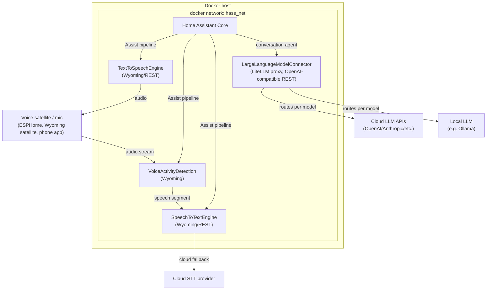

# Home Assistant Setup — Architecture Draft

Status: draft / work in progress
Scope: containerized backend services for the next Home Assistant setup, focused on the voice-assistant pipeline and LLM integration.

## Goals

- Home Assistant Core stays the orchestrator (dashboards, automations, device management, conversation agent) — not a place to embed heavy ML workloads.
- Every non-trivial component (STT, TTS, VAD, LLM routing) runs as its own Docker container with a narrow API, so components can be upgraded, replaced, or scaled independently.
- Prefer protocols HA already understands natively (Wyoming for voice pipeline pieces) over bespoke integrations, falling back to REST + a small custom component only where needed.
- Keep cloud dependency optional and isolated: cloud STT is a fallback path behind a local-first proxy, not a hard requirement.

## Components

| Component | Responsibility | Protocol to HA | Backing |
|---|---|---|---|
| **Home Assistant Core** | Dashboards, automations, device/area management, conversation orchestration, pipeline assembly (Assist) | — | Official `homeassistant/home-assistant` container |
| **SpeechToTextEngine** | Exposes an STT API; internally proxies to a cloud STT provider with fallback to a local STT engine (e.g. Whisper) | Wyoming (preferred) or REST via custom `stt` platform | Custom service wrapping cloud SDK + local model |
| **TextToSpeechEngine** | Local TTS synthesis | Wyoming (preferred) or REST via custom `tts` platform | e.g. Piper, wrapped in its own container |
| **VoiceActivityDetection** | Detects speech segments in an audio stream before STT is invoked | Wyoming | e.g. `openWakeWord`/`webrtcvad`-based Wyoming service |
| **LargeLanguageModelConnector** | Hosts a LiteLLM proxy in front of multiple LLM backends (cloud + local) for the conversation agent | REST (OpenAI-compatible) via HA's `openai_conversation`/`extended_openai_conversation`, or a thin custom `conversation` agent | LiteLLM proxy container |

Everything under "Backing" is a separate container; HA never talks to a model or SDK directly — always through one of these services.

## Topology



## Voice pipeline data flow

1. A voice satellite (ESPHome device, Wyoming satellite, or the HA companion app) streams audio into the **Assist pipeline** configured in HA Core.
2. HA's pipeline sends the stream to **VoiceActivityDetection** first, which trims silence and emits only the speech segment (or acts as a Wyoming VAD stage directly ahead of STT, depending on the Wyoming pipeline HA has).
3. The speech segment goes to **SpeechToTextEngine**. Internally it tries the cloud STT provider first (better accuracy) and falls back to a local model (e.g. Whisper) if the cloud call fails or times out. HA only ever sees one STT API.
4. The transcript goes into HA's conversation agent, which is configured to call **LargeLanguageModelConnector** (LiteLLM) instead of a single hardcoded provider. LiteLLM picks the target model/provider based on its own routing config (cost, latency, capability, or an explicit model alias configured in HA).
5. The LLM response text goes back through HA to **TextToSpeechEngine**, which synthesizes audio locally and streams it back to the originating satellite/device.

Each arrow above is a container-to-container API call inside `hass_net`; nothing here requires HA to know implementation details of STT/TTS/LLM providers — that's encapsulated behind each connector.

## Integration strategy per component

- **VoiceActivityDetection / SpeechToTextEngine / TextToSpeechEngine**: implement (or wrap) the [Wyoming protocol](https://github.com/rhasspy/wyoming) so HA's built-in Wyoming integration can be used as-is — no custom component to maintain. This is the preferred path for all three since HA has first-class support for Wyoming `stt`, `tts`, and `wake-word`/VAD services.
- **LargeLanguageModelConnector**: LiteLLM proxy exposes an OpenAI-compatible REST API, so HA's official `openai_conversation` integration (or `extended_openai_conversation` from HACS if more control over exposed entities/tools is needed) can point at it directly by overriding the API base URL. No custom component needed unless tool-calling against HA entities requires more than what those integrations expose.
- Only fall back to a self-implemented custom component if a component can't speak Wyoming/REST in a way an existing integration supports.

## Docker Compose shape (sketch)

Illustrative only — not final compose files yet.

```yaml
networks:
  hass_net:
    driver: bridge

services:
  homeassistant:
    image: homeassistant/home-assistant:stable
    networks: [hass_net]
    volumes: ["./config/homeassistant:/config"]
    # ...

  vad:
    build: ./services/vad
    networks: [hass_net]

  stt:
    build: ./services/stt
    networks: [hass_net]
    environment:
      - CLOUD_STT_API_KEY=${CLOUD_STT_API_KEY}
      - LOCAL_STT_MODEL=whisper-base

  tts:
    build: ./services/tts
    networks: [hass_net]

  llm-connector:
    image: ghcr.io/berriai/litellm:latest
    networks: [hass_net]
    volumes: ["./config/litellm/config.yaml:/app/config.yaml"]
    environment:
      - OPENAI_API_KEY=${OPENAI_API_KEY}
      - ANTHROPIC_API_KEY=${ANTHROPIC_API_KEY}
```

Each first-party component (`vad`, `stt`, `tts`) lives in its own `services/<name>` directory with its own Dockerfile once implementation starts.

## Cross-cutting concerns (to flesh out later)

- **Secrets**: cloud API keys (STT provider, LLM providers) via `.env` + Docker secrets, never baked into images or committed configs.
- **Networking**: single internal `hass_net` bridge network; only HA (and optionally a reverse proxy) exposed to the host/LAN. STT/TTS/VAD/LLM connector stay internal-only.
- **Observability**: consider a shared logging/metrics story (e.g. container logs to `journald`/Loki) once the pipeline is running, so cloud-fallback events in STT are visible.
- **Resource placement**: local STT/TTS/VAD models are the heaviest components — plan for GPU passthrough or a beefier host if local inference latency becomes the bottleneck; cloud fallback exists partly to hedge this.
- **Failure modes**: define what HA's Assist pipeline does when a connector container is down (timeout behavior, user-facing error) — not yet designed.

## Open questions

- Which local STT model backs the SpeechToTextEngine fallback (Whisper size/variant)?
- Which TTS engine (Piper vs. others) and voice(s)?
- Does the LLM connector need to expose HA-specific tool-calling (control devices via conversation), or is it text-in/text-out only for now?
- Wake word handling — is that part of VoiceActivityDetection's scope or a separate future component?
