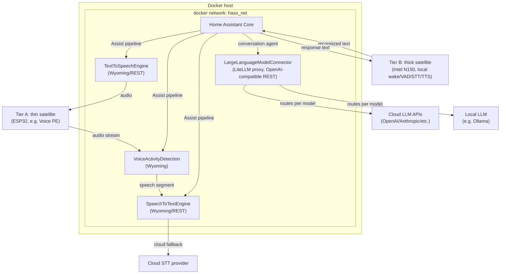

# Home Assistant Setup — Architecture Draft

Status: draft / work in progress
Scope: containerized backend services for the next Home Assistant setup, focused on the voice-assistant pipeline and LLM integration.

## Goals

- Home Assistant Core stays the orchestrator (dashboards, automations, device management, conversation agent) — not a place to embed heavy ML workloads.
- Every non-trivial component (STT, TTS, VAD, LLM routing) runs as its own Docker container with a narrow API, so components can be upgraded, replaced, or scaled independently.
- Prefer protocols HA already understands natively (Wyoming for voice pipeline pieces) over bespoke integrations, falling back to REST + a small custom component only where needed.
- Keep cloud dependency optional and isolated: cloud STT is a fallback path behind a local-first proxy, not a hard requirement.
- Support two satellite tiers side by side (weak ESP32-class devices vs. powerful on-device satellites), configured per device rather than as a global switch.

## Voice pipeline placement: two satellite tiers

The same pipeline stages (wake word, VAD, STT, TTS) can run in two different places depending on satellite hardware. Both tiers coexist; which one a device uses is a per-satellite configuration choice.

### Tier A — thin satellite (e.g. ESP32-based voice devices)

- Hardware only captures/plays audio, plus optionally a cheap local wake word (e.g. ESPHome's `micro_wake_word`).
- VAD, STT, and TTS all run centrally — the `VoiceActivityDetection`, `SpeechToTextEngine`, and `TextToSpeechEngine` containers described below, reached over Wyoming.
- Raw audio crosses the LAN in both directions (mic → VAD/STT, TTS → speaker).
- Fits weak/cheap hardware; trades network bandwidth and round-trip latency for near-zero on-device compute.

### Tier B — thick satellite (e.g. Intel N150 mini PC as satellite)

- Runs wake word, VAD, STT, and TTS locally on the satellite itself — either the same VAD/STT/TTS software packaged to run on-device, or a dedicated local stack (e.g. `wyoming-satellite` + `faster-whisper`/whisper.cpp + Piper + a local VAD).
- Only the recognized text (request) and, on the way back, the response text cross the network. HA and the LLM connector never see raw audio for these devices — the satellite hands HA an already-processed command and speaks HA's text reply itself.
- Not dependent on the central VAD/STT/TTS containers being reachable; needs a capable device to run local inference at acceptable latency.

Both tiers converge at the same point: HA's Assist pipeline passes the transcript to the conversation agent → **LargeLanguageModelConnector**, and gets text back. Tier A then plays that response through the central TTS container; Tier B synthesizes it locally.

### How this is configured in HA

HA's Assist pipeline model, together with the [`wyoming-satellite`](https://github.com/rhasspy/wyoming-satellite) project, already supports this per device: a satellite advertises which stages (wake/VAD/STT/TTS) it handles locally vs. delegates to HA's configured services.

- Tier A devices are left at HA's defaults, which point at the central VAD/STT/TTS containers.
- Tier B devices run their own local wake/VAD/STT/TTS stack and are configured (in their `wyoming-satellite` config) to handle those stages locally, so HA only ever gets invoked for the conversation step.
- Both show up as `assist_satellite` entities in HA; automations built on top don't need to know or care which tier a given device is.

## Components

Central, always-on services. Used directly by Tier A satellites; Tier B satellites run their own local equivalents of VAD/STT/TTS instead of calling these (see above), but still go through `LargeLanguageModelConnector` for the conversation step.

| Component | Responsibility | Protocol to HA | Backing |
|---|---|---|---|
| **Home Assistant Core** | Dashboards, automations, device/area management, conversation orchestration, pipeline assembly (Assist) | — | Official `homeassistant/home-assistant` container |
| **SpeechToTextEngine** *(Tier A)* | Exposes an STT API; internally proxies to a cloud STT provider with fallback to a local STT engine (e.g. Whisper) | Wyoming (preferred) or REST via custom `stt` platform | Custom service wrapping cloud SDK + local model |
| **TextToSpeechEngine** *(Tier A)* | Local TTS synthesis | Wyoming (preferred) or REST via custom `tts` platform | e.g. Piper, wrapped in its own container |
| **VoiceActivityDetection** *(Tier A)* | Detects speech segments in an audio stream before STT is invoked | Wyoming | e.g. `openWakeWord`/`webrtcvad`-based Wyoming service |
| **LargeLanguageModelConnector** | Hosts a LiteLLM proxy in front of multiple LLM backends (cloud + local) for the conversation agent | REST (OpenAI-compatible) via HA's `openai_conversation`/`extended_openai_conversation`, or a thin custom `conversation` agent | LiteLLM proxy container |

Everything under "Backing" is a separate container; HA never talks to a model or SDK directly — always through one of these services.

## Topology



## Voice pipeline data flow

### Tier A (thin satellite, e.g. ESP32)

1. A Tier A satellite streams raw audio into the **Assist pipeline** configured in HA Core.
2. HA's pipeline sends the stream to **VoiceActivityDetection** first, which trims silence and emits only the speech segment (or acts as a Wyoming VAD stage directly ahead of STT, depending on the Wyoming pipeline HA has).
3. The speech segment goes to **SpeechToTextEngine**. Internally it tries the cloud STT provider first (better accuracy) and falls back to a local model (e.g. Whisper) if the cloud call fails or times out. HA only ever sees one STT API.
4. The transcript goes into HA's conversation agent, which is configured to call **LargeLanguageModelConnector** (LiteLLM) instead of a single hardcoded provider. LiteLLM picks the target model/provider based on its own routing config (cost, latency, capability, or an explicit model alias configured in HA).
5. The LLM response text goes back through HA to **TextToSpeechEngine**, which synthesizes audio locally and streams it back to the originating satellite.

### Tier B (thick satellite, e.g. N150)

1. A Tier B satellite runs its own local wake word, VAD, and STT. It only contacts HA once it already has a final transcript — HA never receives raw audio from this device.
2. HA's conversation agent takes that transcript straight to **LargeLanguageModelConnector**, same as Tier A step 4.
3. The LLM response text is sent back to the satellite as text; the satellite synthesizes it with its own local TTS and plays it — the central `TextToSpeechEngine` container is not involved.

Each arrow above is a container-to-container (or satellite-to-container) API call inside/adjacent to `hass_net`; nothing here requires HA to know implementation details of STT/TTS/LLM providers — that's encapsulated behind each connector, and for Tier B, behind the satellite itself.

## Integration strategy per component

- **VoiceActivityDetection / SpeechToTextEngine / TextToSpeechEngine** (Tier A): implement (or wrap) the [Wyoming protocol](https://github.com/rhasspy/wyoming) so HA's built-in Wyoming integration can be used as-is — no custom component to maintain. This is the preferred path for all three since HA has first-class support for Wyoming `stt`, `tts`, and `wake-word`/VAD services.
- **Tier B satellites**: also speak Wyoming, but as a full [`wyoming-satellite`](https://github.com/rhasspy/wyoming-satellite) instance running locally, with its wake/VAD/STT/TTS stages set to "local" in its own config rather than pointing at the central containers. HA sees it as just another `assist_satellite` entity — no custom component needed here either.
- **LargeLanguageModelConnector**: LiteLLM proxy exposes an OpenAI-compatible REST API, so HA's official `openai_conversation` integration (or `extended_openai_conversation` from HACS if more control over exposed entities/tools is needed) can point at it directly by overriding the API base URL. No custom component needed unless tool-calling against HA entities requires more than what those integrations expose.
- Only fall back to a self-implemented custom component if a component can't speak Wyoming/REST in a way an existing integration supports.

## Docker Compose shape (sketch)

Illustrative only — not final compose files yet.

```yaml
networks:
  hass_net:
    driver: bridge

services:
  homeassistant:
    image: homeassistant/home-assistant:stable
    networks: [hass_net]
    volumes: ["./config/homeassistant:/config"]
    # ...

  vad:
    build: ./services/vad
    networks: [hass_net]

  stt:
    build: ./services/stt
    networks: [hass_net]
    environment:
      - CLOUD_STT_API_KEY=${CLOUD_STT_API_KEY}
      - LOCAL_STT_MODEL=whisper-base

  tts:
    build: ./services/tts
    networks: [hass_net]

  llm-connector:
    image: ghcr.io/berriai/litellm:latest
    networks: [hass_net]
    volumes: ["./config/litellm/config.yaml:/app/config.yaml"]
    environment:
      - OPENAI_API_KEY=${OPENAI_API_KEY}
      - ANTHROPIC_API_KEY=${ANTHROPIC_API_KEY}
```

Each first-party component (`vad`, `stt`, `tts`) lives in its own `services/<name>` directory with its own Dockerfile once implementation starts. This compose file covers the central host only; Tier B satellites (e.g. the N150) run their own separate deployment (own `wyoming-satellite` + local VAD/STT/TTS, likely also Docker-based) directly on the satellite hardware, outside this stack.

## Cross-cutting concerns (to flesh out later)

- **Secrets**: cloud API keys (STT provider, LLM providers) via `.env` + Docker secrets, never baked into images or committed configs.
- **Networking**: single internal `hass_net` bridge network; only HA (and optionally a reverse proxy) exposed to the host/LAN. STT/TTS/VAD/LLM connector stay internal-only.
- **Observability**: consider a shared logging/metrics story (e.g. container logs to `journald`/Loki) once the pipeline is running, so cloud-fallback events in STT are visible.
- **Resource placement**: local STT/TTS/VAD models are the heaviest components — plan for GPU passthrough or a beefier host if local inference latency becomes the bottleneck; cloud fallback exists partly to hedge this.
- **Failure modes**: define what HA's Assist pipeline does when a connector container is down (timeout behavior, user-facing error) — not yet designed.

## Open questions

- Which local STT model backs the Tier A SpeechToTextEngine fallback, and Tier B's local STT (same Whisper variant, or something lighter/heavier given the N150's headroom)?
- Which TTS engine (Piper vs. others) and voice(s) — shared choice for Tier A's central TTS and Tier B's local TTS, or allowed to differ per tier?
- Does the LLM connector need to expose HA-specific tool-calling (control devices via conversation), or is it text-in/text-out only for now?
- Wake word handling for Tier A — local on the ESP32 (`micro_wake_word`) or via the central VoiceActivityDetection service?
- Does the N150 need GPU/NPU acceleration to keep local STT/TTS latency acceptable, or is CPU inference (whisper.cpp/Piper) good enough?
- Do Tier B satellites reuse the exact same STT/TTS container images as the central services (consistent behavior, larger footprint) or a separate, lighter-weight local stack?
